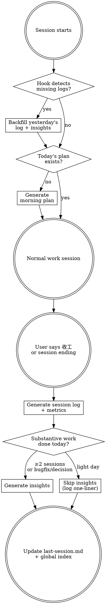
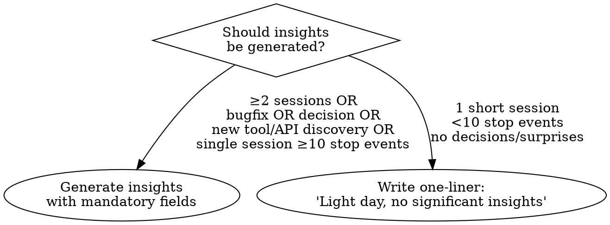

# Dev Horcrux

Split your session's soul before it dies.

## Setup

First-time setup: `bash {SKILL_DIR}/scripts/setup.sh [output-dir]`

This creates the output directory, installs hooks into `~/.claude/ft-settings.json`, and writes a config file.

Config: `~/.claude/dev-horcrux.conf` (created by setup, editable):
```
DEV_HORCRUX_DIR=/path/to/dev-log    # output directory
WIKILINKS=true                       # Obsidian [[]] links (false for plain markdown)
SESSION_FILE=.assistant/runtime/last-session.md
INDEX_FILE=~/.claude/global-projects-index.md
```

## Core Flow



## Morning Plan

**Trigger**: First session of the day, or `[MORNING PLAN]` from hook.

**Housekeeping** (run once per morning, before generating plan):
- Check `global-projects-index.md` Recent Sessions — move entries older than 14 days to Archived Sessions
- Update Projects table `Last Active` if stale
- Run `bash {SKILL_DIR}/scripts/config-health.sh --project-dir <cwd>` — if WARN/ALERT, surface one-liner in plan's "注意事项" section (details deferred to weekly review)

**Data sources** (priority order — use ALL available, don't stop at first):
1. Most recent `{DEV_HORCRUX_DIR}/YYYY-MM-DD.md` → 待跟进 section (most reliable, always up-to-date)
2. `last-session.md` → pending items (WARNING: may be stale if user didn't say "收工")
3. `~/.claude/session-activity.log` → recent dates + project dirs (detect which projects were active)
4. `runtime/inbox.md` → action items
5. Project index → recent context
6. Project `MEMORY.md` files → tagged TODOs

**Staleness check**: If `last-session.md` date is >1 day old, prefer dev-log files and activity.log as primary sources.

**Output**: `{DEV_HORCRUX_DIR}/YYYY-MM-DD-plan.md` — see templates.md for format.

## Evening Session Log

**Trigger**: User says "收工/wrap up/写日志", or Claude detects substantive work is complete.

**Proactive prompt**: If Claude has done substantive work (code changes, bugfix, design) and the user hasn't requested a log, suggest: "今天的 dev-log 还没写，要我现在生成吗？"

### Two output files:

**File 1 — Session Log**: `{DEV_HORCRUX_DIR}/YYYY-MM-DD.md`

**MANDATORY structure — regardless of session content (project work, exploration, fun hacking):**
1. YAML frontmatter (`date`, `type`, `tags`) — always present
2. **Metrics block** — always present, run `collect-metrics.sh` first. If data unavailable, write `(unavailable)` not omit
3. **Session overview table** — always present, even for single-session days
4. Per-session sections with: goal, changes, verification results
5. **Plan review** — always diff against morning plan. If no plan exists, write `plan_review: no plan generated`
6. 今日关键成果 + 待跟进 — always present

Exploratory/creative content (reverse engineering, tool hacking, etc.) goes inside the session sections freely, but the skeleton above is non-negotiable.

**Metrics block** (auto-collected BEFORE writing log):

Run `bash {SKILL_DIR}/scripts/collect-metrics.sh YYYY-MM-DD`. This single command:
1. Collects git stats (commits, files, lines) for the date
2. Runs `discover-sessions.sh` to scan ALL JSONL session files for that date
3. Aggregates tokens/cost across all sessions (not just the current one)
4. Outputs a **Session Summary** markdown table ready to embed in the log

**Do NOT skip this step. Do NOT write `(未采集)` without first running the script.**
**Do NOT manually write the Session Summary table — always use the script output.**
```yaml
## Metrics
sessions: N
conversation_rounds: N        # from session JSONL
tokens: {input: N, output: N, total: N}
estimated_cost: $N.NN
code_changes:                  # from git diff --stat
  files_modified: N
  lines_added: N
  lines_removed: N
  commits: N
tests: {total: N, passed: N, failed: N}
plan_review:                   # compare with morning plan
  p0_completed: "N/N"
  p1_completed: "N/N"
  unplanned_items: N
```

**File 2 — Insights** (conditional): `{DEV_HORCRUX_DIR}/insights/YYYY-MM-DD.md`

See templates.md for full format. Key quality controls:

### Insight Quality Gate



**Mandatory per insight:**
- `source`: Link back to specific session (e.g., "Session 3, P0-2 fix")
- `confidence`: high / medium / low — low-confidence insights excluded from weekly review
- No empty dimensions — only write sections with real content

## Session Discovery (多 session 枚举)

日志中的 Session 总览表**必须基于 discover-sessions.sh 输出**，不允许凭记忆编写。

**当日写日志**: `collect-metrics.sh` 输出已包含 Session Summary 表，直接嵌入日志。

**补写日志 (backfill)**:
1. 运行 `bash {SKILL_DIR}/scripts/discover-sessions.sh YYYY-MM-DD`
2. 输出包含每个 session 的 `first_user_msg` + `cwd` → 用于推断 session 主题
3. 对于大型 session (>100 msgs)，可选择读取 JSONL 尾部获取更多上下文
4. Session 总览表从脚本输出生成，补充主题描述由 Claude 基于 first_user_msg 推断
5. 每个 session 的 `session_id` 可用于 `claude --resume <id>` 回溯

**微型 session 处理**: <5 条消息的 session 已自动过滤。若需包含，传 `--min-msgs=0`。

**时区**: JSONL 时间戳是 UTC，脚本自动转本地时间（默认 UTC+8）。可通过 `dev-horcrux.conf` 的 `TZ_OFFSET_CONF` 配置。

**跨日 session**: 一个 JSONL 可能跨两天活跃（如 23:00 开始次日 02:00 结束），脚本会将其同时出现在两天的报告中。

## Skill 提炼检查（收工时自动触发）

在 insights 生成之后、更新 last-session.md 之前，执行 Skill 提炼检查。

**触发条件**：当日 session 包含以下任一信号：
- 同一类操作重复 3 次以上（如反复调试同一类问题、反复执行类似流程）
- 用户说"以后都这样做"或类似固化意图
- 完成了一个之前没有 skill 覆盖的复杂多步骤工作流
- insights 中出现"流程改进"类条目

**检查流程**：
1. 回顾当日所有 session 的关键操作
2. 对比现有 skill 列表（`ls ~/.claude/skills/*/SKILL.md`）
3. 如果发现可提炼模式，**向用户提议**（不自动创建）：

```
Skill 提炼建议：今天的 [描述] 流程可以封装为 skill。
- 输入：[什么触发]
- 输出：[产出什么]
- 步骤：[3-5步概要]
要现在用 nuwa-skill 创建吗？
```

**规则**：
- 只提议，不自动创建——保持用户控制权（区别于 Hermes 的全自动）
- 每次收工最多提议 1 个 skill（避免疲劳）
- 如果用户拒绝，不记录也不再提——尊重判断
- 如果用户同意，调用 `nuwa-skill` 或 `skill-creator` 执行

## Config Health Audit（配置健康度审计）

定期检测 CLAUDE.md / global-*.md / MEMORY.md / SKILL.md 等基础文件是否膨胀，并提供渐进式披露（Progressive Disclosure）重构建议。

**设计原则**：主文件保持索引角色，详细内容通过 `@path` 引用或独立文件承载。

**脚本**：`bash {SKILL_DIR}/scripts/config-health.sh [--verbose] [--project-dir DIR]`

**阈值**：

| 文件类型 | WARN | ALERT | 说明 |
|---------|------|-------|------|
| `~/.claude/CLAUDE.md` | 15 | 25 | 纯 @path 索引，不应有实质内容 |
| `global-*.md` | 80 | 120 | 单一职责模块 |
| 项目 `CLAUDE.md` | 200 | 300 | 最大的配置单体，优先拆分目标 |
| `MEMORY.md` | 150 | 200 | 系统在 200 行后截断 |
| `SKILL.md` | 400 | 500 | skill-creator 标准 |

**检测信号**：
1. 行数超阈值
2. 内联代码块/表格 > 30 行（提取候选）
3. MEMORY.md 条目 > 150 字符（应精简为索引）

**触发时机**：

| 时机 | 深度 | 行动 |
|------|------|------|
| 晨间 Housekeeping | 轻量：仅跑脚本，有 WARN/ALERT 则一行提示 | 不展开分析 |
| Weekly Review | 完整：脚本 + 语义分析 + 重构建议 | 输出 abstraction plan |

### Weekly 深度分析（Claude 语义层）

脚本只做机械检测。Weekly Review 时 Claude 额外做：

1. **内容归属检查**：项目 CLAUDE.md 中是否有内容应该上移到 global-*.md 或下沉到子项目
2. **重复检测**：跨文件出现的相同规则/说明
3. **抽象建议**：超阈值文件的具体拆分方案

**输出格式**（写入 weekly review 文件）：

```markdown
## 配置健康度

### 脚本报告
[粘贴 config-health.sh --verbose 输出]

### 重构建议
- `<文件>` (N 行): [具体建议]
  - 提取 `<section>` → `<新文件路径>`，主文件用 @path 引用
  - 理由: [为什么]

### 无需操作
- [扫描通过的文件/不紧急的观察]
```

**规则**：
- 只提议，不自动修改——用户确认后执行
- 建议必须具体到"哪段内容 → 提取到哪个文件"，不说"建议考虑拆分"
- 对已经用 @path 组织良好的文件，即使行数接近阈值也不告警——结构健康比行数重要

### Portability（首次运行 / 新用户引导）

其他用户不一定有 `global-*.md` + `@path` 的模块化体系。首次运行 `config-health.sh` 发现 ALERT 时，Claude 应：

1. **展示报告**，说明哪些文件膨胀
2. **提议写入规则**到用户的 CLAUDE.md（全局或项目级），内容示例：

```markdown
## Config Hygiene
- CLAUDE.md 保持索引角色，详细内容拆分到独立 .md 并用 @path 引用
- SKILL.md 控制在 500 行以内，超出部分提取为 references/*.md
- MEMORY.md 条目保持一行 < 150 字符，详细内容写独立文件
```

3. **等用户确认**后才写入——不静默修改任何配置文件
4. 记录已引导状态到 `~/.claude/dev-horcrux.conf`（`CONFIG_HEALTH_ONBOARDED=true`），避免重复引导

**检测逻辑**：读 `dev-horcrux.conf` 中的 `CONFIG_HEALTH_ONBOARDED`。未设置且首次发现 ALERT → 触发引导流程。

## Weekly Review (manual trigger)

When user asks for weekly review, or on Friday/weekend:

**Input**: That week's daily logs + insights
**Output**: `{DEV_HORCRUX_DIR}/weekly/YYYY-WNN.md`

Dimensions:
- Output summary (commits, tests, lines across all days)
- Time allocation by project (from Stop hook activity log)
- Plan accuracy trend (planned vs actual completion rate)
- Insight aggregation (recurring themes → promotion candidates)
- Next week suggestions (from accumulated deferred items)
- **Config health audit** (see Config Health Audit section above)
- **Behavioral inference** (see below)

### Behavioral Inference（行为推断）

Weekly review 新增维度：从一周的 session 记录中推断行为模式变化，自动提议更新 `global-user.md`。

**分析维度**：

| 信号 | 推断 | 更新目标 |
|------|------|---------|
| 时间分配偏移 | "本周 70% 时间在 content-produce，上周是 MDK 开发" | `global-user.md` context |
| 新工具/模式出现 | "开始频繁使用 Chrome DevTools MCP" | `global-user.md` knowledge |
| 决策模式变化 | "本周 3 次选择了快速交付而非完美方案" | `global-workflow.md` 决策风格 |
| Skill 使用频率 | "delphi 本周用了 5 次，advisory-board 0 次" | Skill 优先级调整 |

**输出格式**（写入 weekly review 文件）：

```markdown
## 行为推断

### 观察
- [具体观察，附数据]

### 建议更新
- `global-user.md` line X: [当前内容] → [建议内容]
- 理由: [为什么]

### 不建议更新的观察
- [看到了但可能只是本周偶发，不足以改配置]
```

**规则**：
- 只在 weekly review 中做，不在 daily log 中做——避免过度拟合单日波动
- 只提议更新，不自动修改配置文件——用户确认后手动或授权更新
- 至少需要 3 天以上的数据才做推断——少于 3 天说"数据不足，跳过"
- 推断必须有数据支撑（session 数、时间占比、操作频次），不能靠"感觉"

## Persistent Scheduling (CronCreate 自续期)

可选功能：设置 durable cron 自动触发晨间计划和晚间日志。详见 [references/scheduling.md](references/scheduling.md)。

## Hook Scripts

| Hook | Event | Purpose |
|---|---|---|
| `stop-hook.sh` | Stop | Record timestamp + cwd to activity log |
| `session-start-hook.sh` | SessionStart | Scan last 7 days for missing logs, inject backfill prompt |
| `discover-sessions.sh` | Manual | Scan all JSONL files for a date, output structured session list |
| `collect-metrics.sh` | Manual | Git stats + discover-sessions aggregation + session summary table |

Stop hook enhanced output (`~/.claude/session-activity.log`):
```
2026-04-03T14:30:22|/home/user/projects/alpha
2026-04-03T16:45:10|/home/user/projects/beta
```

## Plan Session State (跨 Session 续接)

When a session is ending (收工, context full, or pause) while a plan is being executed:

**Auto-update the plan file** with a `## Session State` section at the bottom:

```markdown
## Session State
<!-- Updated: YYYY-MM-DD HH:MM by dev-horcrux -->

**Current task:** Task 2.3 (Step 4 — running tests)
**Completed:** Task 1.1 ✓, Task 1.2 ✓, Task 2.1 ✓, Task 2.2 ✓
**Blockers:** None | [describe blocker]
**Key decisions this session:**
- [Decision 1]: [rationale]
**Next session entry point:** Start from Task 2.3 Step 4, run verify command first
```

**Rules:**
- Only update if a plan file is actively being executed (check TodoList for plan tasks)
- Write to the plan file itself, not a separate file — single source of truth
- The `<!-- Updated -->` comment prevents stale state confusion
- This section replaces scattered state across last-session.md / memory / task list
- On session start, if plan has Session State section, read it first to restore context

**Integration with 收工 flow:**
After generating session log, check if any plan was in-progress. If yes, update its Session State section before writing last-session.md.

## Common Mistakes

| Mistake | Fix |
|---|---|
| Generating verbose insights on light days | Check insight quality gate first |
| Hardcoding paths | Always read from `~/.claude/dev-horcrux.conf` |
| Forgetting plan review in evening log | Always diff plan vs actual, even if plan was empty |
| Writing insights without source links | Every insight MUST link to a specific session |
| Writing Session Summary from memory | Always use `collect-metrics.sh` / `discover-sessions.sh` output |
| Only counting current session's tokens | `collect-metrics.sh` now aggregates ALL sessions for the day |
| Missing multi-day backfill | Hook scans last 7 days, not just yesterday |
