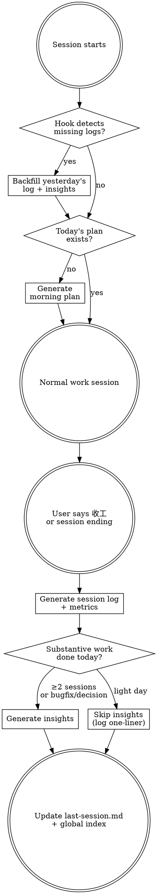
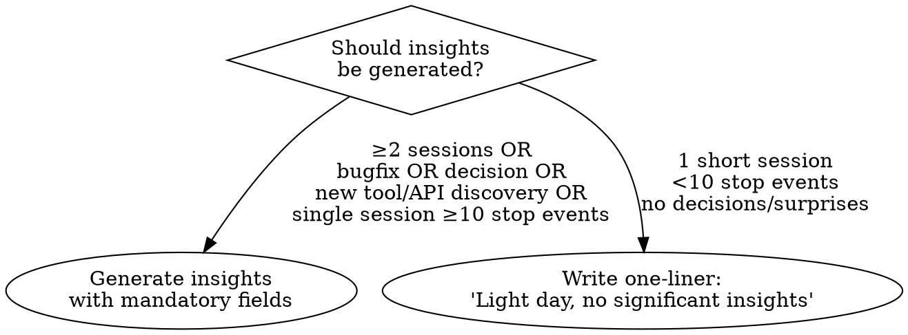

# Dev Horcrux

Split your session's soul before it dies.

## Setup

First-time setup: `bash {SKILL_DIR}/scripts/setup.sh [output-dir]`

This creates the output directory, installs hooks into `~/.claude/ft-settings.json`, and writes a config file.

Config: `~/.claude/dev-horcrux.conf` (created by setup, editable):
```
DEV_HORCRUX_DIR=/path/to/dev-log    # output directory
WIKILINKS=true                       # Obsidian [[]] links (false for plain markdown)
SESSION_FILE=.assistant/runtime/last-session.md
INDEX_FILE=~/.claude/global-projects-index.md
```

## Core Flow



## Morning Plan

**Trigger**: First session of the day, or `[MORNING PLAN]` from hook.

**Housekeeping** (run once per morning, before generating plan):
- Check `global-projects-index.md` Recent Sessions — move entries older than 14 days to Archived Sessions
- Update Projects table `Last Active` if stale

**Data sources** (priority order — use ALL available, don't stop at first):
1. Most recent `{DEV_HORCRUX_DIR}/YYYY-MM-DD.md` → 待跟进 section (most reliable, always up-to-date)
2. `last-session.md` → pending items (WARNING: may be stale if user didn't say "收工")
3. `~/.claude/session-activity.log` → recent dates + project dirs (detect which projects were active)
4. `runtime/inbox.md` → action items
5. Project index → recent context
6. Project `MEMORY.md` files → tagged TODOs

**Staleness check**: If `last-session.md` date is >1 day old, prefer dev-log files and activity.log as primary sources.

**Output**: `{DEV_HORCRUX_DIR}/YYYY-MM-DD-plan.md` — see templates.md for format.

## Evening Session Log

**Trigger**: User says "收工/wrap up/写日志", or Claude detects substantive work is complete.

**Proactive prompt**: If Claude has done substantive work (code changes, bugfix, design) and the user hasn't requested a log, suggest: "今天的 dev-log 还没写，要我现在生成吗？"

### Two output files:

**File 1 — Session Log**: `{DEV_HORCRUX_DIR}/YYYY-MM-DD.md`

**MANDATORY structure — regardless of session content (project work, exploration, fun hacking):**
1. YAML frontmatter (`date`, `type`, `tags`) — always present
2. **Metrics block** — always present, run `collect-metrics.sh` first. If data unavailable, write `(unavailable)` not omit
3. **Session overview table** — always present, even for single-session days
4. Per-session sections with: goal, changes, verification results
5. **Plan review** — always diff against morning plan. If no plan exists, write `plan_review: no plan generated`
6. 今日关键成果 + 待跟进 — always present

Exploratory/creative content (reverse engineering, tool hacking, etc.) goes inside the session sections freely, but the skeleton above is non-negotiable.

**Metrics block** (auto-collected BEFORE writing log):

Run `bash {SKILL_DIR}/scripts/collect-metrics.sh YYYY-MM-DD`. This single command:
1. Collects git stats (commits, files, lines) for the date
2. Runs `discover-sessions.sh` to scan ALL JSONL session files for that date
3. Aggregates tokens/cost across all sessions (not just the current one)
4. Outputs a **Session Summary** markdown table ready to embed in the log

**Do NOT skip this step. Do NOT write `(未采集)` without first running the script.**
**Do NOT manually write the Session Summary table — always use the script output.**
```yaml
## Metrics
sessions: N
conversation_rounds: N        # from session JSONL
tokens: {input: N, output: N, total: N}
estimated_cost: $N.NN
code_changes:                  # from git diff --stat
  files_modified: N
  lines_added: N
  lines_removed: N
  commits: N
tests: {total: N, passed: N, failed: N}
plan_review:                   # compare with morning plan
  p0_completed: "N/N"
  p1_completed: "N/N"
  unplanned_items: N
```

**File 2 — Insights** (conditional): `{DEV_HORCRUX_DIR}/insights/YYYY-MM-DD.md`

See templates.md for full format. Key quality controls:

### Insight Quality Gate



**Mandatory per insight:**
- `source`: Link back to specific session (e.g., "Session 3, P0-2 fix")
- `confidence`: high / medium / low — low-confidence insights excluded from weekly review
- No empty dimensions — only write sections with real content

## Session Discovery (多 session 枚举)

日志中的 Session 总览表**必须基于 discover-sessions.sh 输出**，不允许凭记忆编写。

**当日写日志**: `collect-metrics.sh` 输出已包含 Session Summary 表，直接嵌入日志。

**补写日志 (backfill)**:
1. 运行 `bash {SKILL_DIR}/scripts/discover-sessions.sh YYYY-MM-DD`
2. 输出包含每个 session 的 `first_user_msg` + `cwd` → 用于推断 session 主题
3. 对于大型 session (>100 msgs)，可选择读取 JSONL 尾部获取更多上下文
4. Session 总览表从脚本输出生成，补充主题描述由 Claude 基于 first_user_msg 推断
5. 每个 session 的 `session_id` 可用于 `claude --resume <id>` 回溯

**微型 session 处理**: <5 条消息的 session 已自动过滤。若需包含，传 `--min-msgs=0`。

**时区**: JSONL 时间戳是 UTC，脚本自动转本地时间（默认 UTC+8）。可通过 `dev-horcrux.conf` 的 `TZ_OFFSET_CONF` 配置。

**跨日 session**: 一个 JSONL 可能跨两天活跃（如 23:00 开始次日 02:00 结束），脚本会将其同时出现在两天的报告中。

## Weekly Review (manual trigger)

When user asks for weekly review, or on Friday/weekend:

**Input**: That week's daily logs + insights
**Output**: `{DEV_HORCRUX_DIR}/weekly/YYYY-WNN.md`

Dimensions:
- Output summary (commits, tests, lines across all days)
- Time allocation by project (from Stop hook activity log)
- Plan accuracy trend (planned vs actual completion rate)
- Insight aggregation (recurring themes → promotion candidates)
- Next week suggestions (from accumulated deferred items)

## Hook Scripts

| Hook | Event | Purpose |
|---|---|---|
| `stop-hook.sh` | Stop | Record timestamp + cwd to activity log |
| `session-start-hook.sh` | SessionStart | Scan last 7 days for missing logs, inject backfill prompt |
| `discover-sessions.sh` | Manual | Scan all JSONL files for a date, output structured session list |
| `collect-metrics.sh` | Manual | Git stats + discover-sessions aggregation + session summary table |

Stop hook enhanced output (`~/.claude/session-activity.log`):
```
2026-04-03T14:30:22|/home/user/projects/alpha
2026-04-03T16:45:10|/home/user/projects/beta
```

## Common Mistakes

| Mistake | Fix |
|---|---|
| Generating verbose insights on light days | Check insight quality gate first |
| Hardcoding paths | Always read from `~/.claude/dev-horcrux.conf` |
| Forgetting plan review in evening log | Always diff plan vs actual, even if plan was empty |
| Writing insights without source links | Every insight MUST link to a specific session |
| Writing Session Summary from memory | Always use `collect-metrics.sh` / `discover-sessions.sh` output |
| Only counting current session's tokens | `collect-metrics.sh` now aggregates ALL sessions for the day |
| Missing multi-day backfill | Hook scans last 7 days, not just yesterday |
