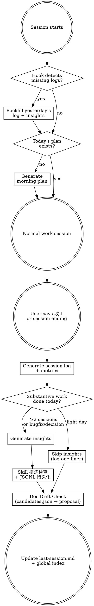
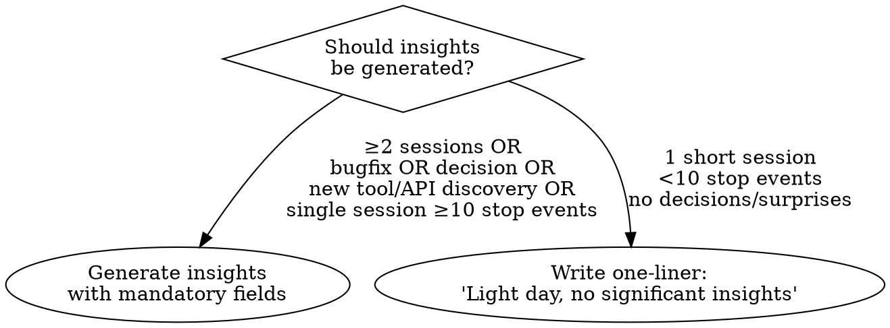

# Dev Horcrux

Split your session's soul before it dies.

## Setup

First-time setup: `bash {SKILL_DIR}/scripts/setup.sh [output-dir]`

This creates the output directory, installs hooks into `~/.claude/ft-settings.json`, and writes a config file.

Config: `~/.claude/dev-horcrux.conf` (created by setup, editable):
```
DEV_HORCRUX_DIR=/path/to/dev-log    # output directory
WIKILINKS=true                       # Obsidian [[]] links (false for plain markdown)
SESSION_FILE=.claude/runtime/last-session.md
INDEX_FILE=~/.claude/global-projects-index.md
```

## Core Flow



## Morning Plan

**Trigger**: First session of the day, or `[MORNING PLAN]` from hook.

**Housekeeping** (run once per morning, before generating plan):
- Check `global-projects-index.md` Recent Sessions — move entries older than 14 days to Archived Sessions
- Update Projects table `Last Active` if stale
- Run `bash {SKILL_DIR}/scripts/config-health.sh --project-dir <cwd>` — if WARN/ALERT, surface one-liner in plan's "注意事项" section (details deferred to weekly review)

**Data sources** (priority order — use ALL available, don't stop at first):
1. Most recent `{DEV_HORCRUX_DIR}/YYYY-MM-DD.md` → 待跟进 section (most reliable, always up-to-date)
2. `last-session.md` → pending items (WARNING: may be stale if user didn't say "收工")
3. `~/.claude/session-activity.log` → recent dates + project dirs (detect which projects were active)
4. `runtime/inbox.md` → action items
5. Project index → recent context
6. Project `MEMORY.md` files → tagged TODOs

**Staleness check**: If `last-session.md` date is >1 day old, prefer dev-log files and activity.log as primary sources.

### Carryover Staleness Check（v1.10.0+ — 欠账反向核查）

**Problem**: 待跟进条目会从上一个 log 继承到今日 plan，但生成时不核对完成证据 → 已做的事被反复重列为欠账，每天 +1 天计数。真实案例：`anticrawl observation insight 归档` 在 `insights/2026-04-27/28/29.md` 三天都归档了，但 04-30 到 05-03 的 plan 仍然把它列为"欠账第 N 天"。

**Rule**: 对每条从上游 log 继承过来的待跟进条目，在写入今日 plan 之前执行证据反向搜索：

```
for each carryover_item in previous_log.待跟进:
    keywords = extract_keywords(carryover_item)  # 如 "anticrawl insight" / "新闻联播 spec"
    evidence = search(keywords) in:
      - {DEV_HORCRUX_DIR}/insights/*.md     # insight 归档
      - ~/.claude/.../memory/*.md           # memory 条目
      - docs/specs/*.md / docs/plans/*.md   # 设计/计划文档
      - git log since carryover_date         # 代码实现
    if evidence found:
      mark "✅ 已完成（证据: <path:line>），本 plan 不再携带"
      add correction note to previous log's 待跟进 section (strike-through + stale 修正批注)
    else:
      carry forward, +1 天计数
```

**When to apply**:
- 每次生成 morning plan 时，对"老欠账"/"待跟进"section 的每条做一次
- 不依赖关键词完美匹配——宁可过度核查（grep 多个同义词）也不要漏掉
- 如果不确定是否已做，降级为"待用户确认"而不是盲目携带

**Edge cases**:
- 欠账条目太模糊（如"flow 优化"）→ 无法反查，直接带入但加 `[待澄清]` 标签
- 部分完成（如 spec 起草了但未实施）→ 拆成两条，"spec ✅"和"实施 [ ]"

**Why this matters**: 无核查的欠账继承机制 = 欠账通胀。用户看到的"连续 N 天未做"可能是系统 bug 而非执行问题，会误导优先级判断。

**Output**: `{DEV_HORCRUX_DIR}/YYYY-MM-DD-plan.md` — see templates.md for format.

## Evening Session Log

**Trigger**: User says "收工/wrap up/写日志", or Claude detects substantive work is complete.

**Proactive prompt**: If Claude has done substantive work (code changes, bugfix, design) and the user hasn't requested a log, suggest: "今天的 dev-log 还没写，要我现在生成吗？"

### Two output files:

**File 1 — Session Log**: `{DEV_HORCRUX_DIR}/YYYY-MM-DD.md`

**MANDATORY structure — regardless of session content (project work, exploration, fun hacking):**
1. YAML frontmatter (`date`, `type`, `tags`) — always present
2. **Metrics block** — always present, run `collect-metrics.sh` first. If data unavailable, write `(unavailable)` not omit
3. **Session overview table** — always present, even for single-session days
4. Per-session sections with: goal, changes, verification results
5. **Plan review** — always diff against morning plan. If no plan exists, write `plan_review: no plan generated`
6. 今日关键成果 + 待跟进 — always present

Exploratory/creative content (reverse engineering, tool hacking, etc.) goes inside the session sections freely, but the skeleton above is non-negotiable.

**Metrics block** (auto-collected BEFORE writing log):

Run `bash {SKILL_DIR}/scripts/collect-metrics.sh YYYY-MM-DD`. This single command:
1. Collects git stats (commits, files, lines) for the date
2. Runs `discover-sessions.sh` to scan ALL JSONL session files for that date
3. Aggregates tokens/cost across all sessions (not just the current one)
4. Outputs a **Session Summary** markdown table ready to embed in the log

**Do NOT skip this step. Do NOT write `(未采集)` without first running the script.**
**Do NOT manually write the Session Summary table — always use the script output.**
```yaml
## Metrics
sessions: N
conversation_rounds: N        # from session JSONL
tokens: {input: N, output: N, cache_read: N, total: N}
tokens_by_model:               # per-model breakdown (v1.8.0+)
  claude-opus-4-7: {input: N, output: N, cache_read: N, cache_create: N}
  claude-sonnet-4-6: {input: N, output: N, cache_read: N, cache_create: N}
estimated_cost: $N.NN          # per-model pricing (Anthropic public list)
estimated_cost_by_model:       # per-model cost breakdown (v1.8.0+)
  claude-opus-4-7: $N.NN
  claude-sonnet-4-6: $N.NN
tool_calls:                    # top tools by frequency (v1.8.0+)
  Bash: N
  Read: N
  Edit: N
errors: N                      # isError events (v1.8.0+)
code_changes:                  # from git diff --stat
  files_modified: N
  lines_added: N
  lines_removed: N
  commits: N
tests: {total: N, passed: N, failed: N}
plan_review:                   # compare with morning plan
  p0_completed: "N/N"
  p1_completed: "N/N"
  unplanned_items: N
```

**File 2 — Insights** (conditional): `{DEV_HORCRUX_DIR}/insights/YYYY-MM-DD.md`

See templates.md for full format. Key quality controls:

### Insight Quality Gate



**Mandatory per insight:**
- `source`: Link back to specific session (e.g., "Session 3, P0-2 fix")
- `confidence`: high / medium / low — low-confidence insights excluded from weekly review
- `kind`: v1.9.0+，5 类 MECE 之一（见下）
- No empty dimensions — only write sections with real content

**Insight `kind` 字段（v1.9.0+，5 类 MECE）：**

| kind | 含义 |
|---|---|
| `model` | 数据结构 / 实体关系 |
| `decision` | 技术选型 + 理由 |
| `guideline` | recommend / avoid 类规则 |
| `pitfall` | 已知陷阱 / 故障模式 |
| `process` | 流程 / 状态机 / 步骤 |

frontmatter 的 `type: daily-insights` 标识文件类型；条目内 `kind:` 标识内容形态，两者独立。
旧 insights 不回填，新写的加即可。Weekly Review 时按 kind 聚合统计。

## Session Discovery (多 session 枚举)

日志中的 Session 总览表**必须基于 discover-sessions.sh 输出**，不允许凭记忆编写。

**当日写日志**: `collect-metrics.sh` 输出已包含 Session Summary 表，直接嵌入日志。

**补写日志 (backfill)**:
1. 运行 `bash {SKILL_DIR}/scripts/discover-sessions.sh YYYY-MM-DD`
2. 输出包含每个 session 的 `first_user_msg` + `cwd` → 用于推断 session 主题
3. 对于大型 session (>100 msgs)，可选择读取 JSONL 尾部获取更多上下文
4. Session 总览表从脚本输出生成，补充主题描述由 Claude 基于 first_user_msg 推断
5. 每个 session 的 `session_id` 可用于 `claude --resume <id>` 回溯

**微型 session 处理**: <5 条消息的 session 已自动过滤。若需包含，传 `--min-msgs=0`。

**时区**: JSONL 时间戳是 UTC，脚本自动转本地时间（默认 UTC+8）。可通过 `dev-horcrux.conf` 的 `TZ_OFFSET_CONF` 配置。

**跨日 session**: 一个 JSONL 可能跨两天活跃（如 23:00 开始次日 02:00 结束），脚本会将其同时出现在两天的报告中。

## Skill 提炼检查（收工时自动触发）

在 insights 生成之后、更新 last-session.md 之前，执行 Skill 提炼检查。

### 信号检测

**触发条件**（当日 session 包含以下任一信号）：
- 同一类操作重复 3 次以上（如反复调试同一类问题、反复执行类似流程）
- 用户说"以后都这样做"或类似固化意图
- 完成了一个之前没有 skill 覆盖的复杂多步骤工作流
- insights 中出现"流程改进"类条目

### 检查流程

1. 回顾当日所有 session 的关键操作
2. 对比现有 skill 列表（`ls ~/.claude/skills/*/SKILL.md`）
3. 如果发现可提炼模式：
   a. 写入 insights 文件的"Skill 候选"维度（见 templates.md）
   b. medium/high 置信度的候选追加到跨日追踪文件
   c. 检查是否有跨日强化信号

### JSONL 持久化（借鉴 Discovery Pipeline 信号机制）

**文件**：`{DEV_HORCRUX_DIR}/insights/skill-candidates.jsonl`（单文件追加，非按日分文件）

**记录格式**：
```json
{
  "date": "2026-04-20",
  "name": "视频合成流程",
  "identifier": "skill:video-synthesis",
  "signal_type": "repetition",
  "source": "Session 2, EP01-EP03 视频生成",
  "description": "Live Photo → 场景剪辑 → 配音 → 合成，3 集重复相同步骤",
  "confidence": "medium",
  "existing_skill": "video-from-photos (部分覆盖)",
  "status": "pending"
}
```

**字段说明**：
- `identifier`：去重键，格式 `skill:<slug>`。同一 identifier 跨日出现 = 信号强化
- `signal_type`：repetition / workflow / user_intent / process_improvement / cross_session
- `confidence`：high / medium（low 不写入 JSONL，仅写入 insights 供浏览）
- `existing_skill`：最接近的现有 skill，便于判断是新建还是增强
- `status`：pending → proposed → created / dismissed

**去重规则**：同一 identifier + 同一 date 只写一条（避免单日重复刷信号）。

### 跨日强化检查

写入 JSONL 后，扫描该文件中同一 identifier 的历史记录：

| 出现天数 | 动作 |
|---------|------|
| 1 天 | 不额外提议（已写入 insights，等待累积） |
| 2 天 | 在 insights 中标注"二次出现，观察中" |
| ≥3 天 | 升级为强推荐，向用户提议 |

**强推荐提议格式**（≥3 天信号累积时）：

```
Skill 强推荐（跨 N 天信号累积）：
[名称] — [一句话描述]
- 信号历史: [日期1] repetition, [日期2] workflow, [日期3] process_improvement
- 输入: [触发条件]
- 输出: [产出]
- 步骤: [3-5 步概要]
- 现有覆盖: [最近的 skill] — [差距]
要用 skill-creator 创建吗？
```

**普通提议格式**（单日 high confidence，无跨日信号）：

```
Skill 提炼建议：今天的 [描述] 流程可以封装为 skill。
- 输入：[触发]
- 输出：[产出]
- 步骤：[3-5 步概要]
要现在用 skill-creator 创建吗？
```

### 规则

- 只提议，不自动创建——保持用户控制权
- 每次收工最多提议 1 个 skill（优先提议跨日强推荐，其次当日 high confidence）
- 如果用户拒绝：更新 JSONL 中该 identifier 的 status 为 `dismissed`，后续不再提议
- 如果用户同意：更新 status 为 `created`，调用 `skill-creator` 执行
- JSONL 保留 90 天，超期自动忽略（不删文件，查询时过滤）
- dismissed 的候选如果后续再次出现新信号（不同 date），重新激活为 pending

## Doc Drift Check（文档漂移检查）

收工时检测：今日代码/配置变更是否让某些文档（CLAUDE.md / MEMORY.md / README）过时。

**触发时机**：收工 Step 3.5——Skill 提炼检查之后，last-session.md 更新之前。

**脚本不调 LLM**：Claude 在收工会话里自己读 `candidates.json` 做语义对比，保持单一控制面。

### 执行流程

1. 运行 `python3 {SKILL_DIR}/scripts/doc-drift.py <date> --project-dir <cwd> --output <path>`
2. Claude 读 candidates.json，对每个候选做语义对比：
   - diff 里 symbol 改名/删除 → 目标文档段落是否还在用旧名？
   - 新增 public 函数/类 → 目标文档 API 表是否缺失？
   - 规则/配置变更 → CLAUDE.md 说明是否过期？
3. 生成"文档漂移"section 写入当日 dev-log
4. 等用户回复"全部应用 / 选择 1,3 / 跳过"

### 候选 JSON 结构

```json
{
  "date": "YYYY-MM-DD",
  "diff_summary": {"files": N, "insertions": N, "deletions": N, "oversize": bool},
  "candidates": [
    {
      "id": 1,
      "rule_pattern": "*-kit/**/*.py",
      "severity": "high|medium|low",
      "changed_file": "path",
      "changed_symbols": ["foo", "bar"],
      "target_doc": "path/to/CLAUDE.md",
      "check_hints": ["自然语言提示"],
      "snippets": [{"heading": "## API", "line": N, "content": "...", "matched_symbols": [...]}]
    }
  ],
  "total_candidates": N,
  "truncated": bool
}
```

### 成本控制（脚本层硬限）

- 候选上限 10 条（超出按 severity 排序截断，标记 `truncated: true`）
- Diff >500 行：只读 name-status，不提取 symbol（`oversize: true`）
- JSON >100KB：压缩 snippets content（截至 200 字/段）

### 输出到 dev-log 的模板

```markdown
## 文档漂移检查

### 建议更新（N 项）
1. `docs/foo.md:L42` — 代码把 `bar()` 改名 `baz()`，文档未同步
   patch: - bar() → baz()
2. `MEMORY.md:L15` — 条目提到的 `scripts/old.py` 今日已删除
   建议：删除条目

### 建议忽略
- `xxx.md` 提到 `yyy` 但 diff 只是 comment 调整

是否应用？回"全部应用"/"选择 1,3"/"跳过"。
```

**交互规则**（参考 `feedback_batch_delete_confirm`）：
- 0 项：一行摘要 `文档漂移检查: 0 项`，不展开
- >10 项：只展示前 5 条 + 总数，提议分批处理
- 用户未回复：proposal 保留在 dev-log，不阻塞收工，下次可继续处理

### 影响矩阵配置

`{SKILL_DIR}/scripts/drift-rules.yaml`——glob pattern + check_hints，用户可热改，改后下次收工即生效。

**规则格式**：
```yaml
rules:
  - pattern: "*-kit/**/*.py"     # glob，支持 `**` 跨层
    diff_filter: any              # any | new_file | new_key（v1 只认 any）
    check_hints:
      - "Kit CLAUDE.md 的 API 表是否反映新/改名/删除的 public 函数/类"
    severity: medium              # high | medium | low
```

**Glob 语义**（shell 风格）：
- `*` 单层（不跨 `/`）
- `**` 跨任意层（含零层）
- `?` 单字符
- 其他走 fnmatch

### 非目标

- 不做自动 commit——proposal 必须用户确认
- 不做 AST 级 symbol 提取——diff 文本 grep 近似覆盖 80%
- 不检查 article/dev-log/insights（时间戳归档天然不漂移）
- 不全量扫描——只针对今日 diff 触发

## Config Health Audit（配置健康度审计）

定期检测 CLAUDE.md / global-*.md / MEMORY.md / SKILL.md 等基础文件是否膨胀，并提供渐进式披露（Progressive Disclosure）重构建议。

**设计原则**：主文件保持索引角色，详细内容通过 `@path` 引用或独立文件承载。

**脚本**：`bash {SKILL_DIR}/scripts/config-health.sh [--verbose] [--project-dir DIR]`

**阈值**：

| 文件类型 | WARN | ALERT | 说明 |
|---------|------|-------|------|
| `~/.claude/CLAUDE.md` | 15 | 25 | 纯 @path 索引，不应有实质内容 |
| `global-*.md` | 80 | 120 | 单一职责模块 |
| 项目 `CLAUDE.md` | 200 | 300 | 最大的配置单体，优先拆分目标 |
| `MEMORY.md` | 150 | 200 | 系统在 200 行后截断 |
| `SKILL.md` | 400 | 500 | skill-creator 标准 |

**检测信号**：
1. 行数超阈值
2. 内联代码块/表格 > 30 行（提取候选）
3. MEMORY.md 条目 > 150 字符（应精简为索引）

**触发时机**：

| 时机 | 深度 | 行动 |
|------|------|------|
| 晨间 Housekeeping | 轻量：仅跑脚本，有 WARN/ALERT 则一行提示 | 不展开分析 |
| Weekly Review | 完整：脚本 + 语义分析 + 重构建议 | 输出 abstraction plan |

### Weekly 深度分析（Claude 语义层）

脚本只做机械检测。Weekly Review 时 Claude 额外做：

1. **内容归属检查**：项目 CLAUDE.md 中是否有内容应该上移到 global-*.md 或下沉到子项目
2. **重复检测**：跨文件出现的相同规则/说明
3. **抽象建议**：超阈值文件的具体拆分方案

**输出格式**（写入 weekly review 文件）：

```markdown
## 配置健康度

### 脚本报告
[粘贴 config-health.sh --verbose 输出]

### 重构建议
- `<文件>` (N 行): [具体建议]
  - 提取 `<section>` → `<新文件路径>`，主文件用 @path 引用
  - 理由: [为什么]

### 无需操作
- [扫描通过的文件/不紧急的观察]
```

**规则**：
- 只提议，不自动修改——用户确认后执行
- 建议必须具体到"哪段内容 → 提取到哪个文件"，不说"建议考虑拆分"
- 对已经用 @path 组织良好的文件，即使行数接近阈值也不告警——结构健康比行数重要

### Portability（首次运行 / 新用户引导）

其他用户不一定有 `global-*.md` + `@path` 的模块化体系。首次运行 `config-health.sh` 发现 ALERT 时，Claude 应：

1. **展示报告**，说明哪些文件膨胀
2. **提议写入规则**到用户的 CLAUDE.md（全局或项目级），内容示例：

```markdown
## Config Hygiene
- CLAUDE.md 保持索引角色，详细内容拆分到独立 .md 并用 @path 引用
- SKILL.md 控制在 500 行以内，超出部分提取为 references/*.md
- MEMORY.md 条目保持一行 < 150 字符，详细内容写独立文件
```

3. **等用户确认**后才写入——不静默修改任何配置文件
4. 记录已引导状态到 `~/.claude/dev-horcrux.conf`（`CONFIG_HEALTH_ONBOARDED=true`），避免重复引导

**检测逻辑**：读 `dev-horcrux.conf` 中的 `CONFIG_HEALTH_ONBOARDED`。未设置且首次发现 ALERT → 触发引导流程。

## Weekly Review (auto on Sunday + manual on demand)

**Auto (v1.10.0+)**: `[DEV-HORCRUX WEEKLY CRON]` fires every Sunday 20:03 (self-renewing, see `references/scheduling.md`). Skips if the week's file already exists.

**Manual**: triggered when user asks for weekly review, or on Friday/weekend:

**Input**: That week's daily logs + insights
**Output**: `{DEV_HORCRUX_DIR}/weekly/YYYY-WNN.md`

Dimensions:
- Output summary (commits, tests, lines across all days)
- Time allocation by project (from Stop hook activity log)
- Plan accuracy trend (planned vs actual completion rate)
- Insight aggregation (recurring themes → promotion candidates)
- **Skill candidate aggregation** (from skill-candidates.jsonl — see Skill 提炼检查 section)
- Next week suggestions (from accumulated deferred items)
- **Config health audit** (see Config Health Audit section above)
- **Behavioral inference** (see below)

### Skill 候选聚合

扫描 `{DEV_HORCRUX_DIR}/insights/skill-candidates.jsonl`，筛选本周（status=pending）条目，按 identifier 分组：

| 判定 | 条件 | 动作 |
|------|------|------|
| 强推荐 | ≥3 天出现 | 输出完整 spec 草案，向用户提议创建 |
| 观察 | 2 天出现，或 1 天 high confidence | 带入下周继续追踪 |
| 放弃 | 1 天 + 非 high confidence | 标记 status=dismissed |

输出表格写入 weekly review 文件（格式见 templates.md）。

dismissed 的候选如果后续周再次出现新信号，重新激活为 pending（信号比人工判断优先）。

### Behavioral Inference（行为推断）

Weekly review 新增维度：从一周的 session 记录中推断行为模式变化，自动提议更新 `global-user.md`。

**分析维度**：

| 信号 | 推断 | 更新目标 |
|------|------|---------|
| 时间分配偏移 | "本周 70% 时间在 content-produce，上周是 MDK 开发" | `global-user.md` context |
| 新工具/模式出现 | "开始频繁使用 Chrome DevTools MCP" | `global-user.md` knowledge |
| 决策模式变化 | "本周 3 次选择了快速交付而非完美方案" | `global-workflow.md` 决策风格 |
| Skill 使用频率 | "delphi 本周用了 5 次，advisory-board 0 次" | Skill 优先级调整 |

**输出格式**（写入 weekly review 文件）：

```markdown
## 行为推断

### 观察
- [具体观察，附数据]

### 建议更新
- `global-user.md` line X: [当前内容] → [建议内容]
- 理由: [为什么]

### 不建议更新的观察
- [看到了但可能只是本周偶发，不足以改配置]
```

**规则**：
- 只在 weekly review 中做，不在 daily log 中做——避免过度拟合单日波动
- 只提议更新，不自动修改配置文件——用户确认后手动或授权更新
- 至少需要 3 天以上的数据才做推断——少于 3 天说"数据不足，跳过"
- 推断必须有数据支撑（session 数、时间占比、操作频次），不能靠"感觉"

## Persistent Scheduling (CronCreate 自续期)

可选功能：设置 durable cron 自动触发晨间计划和晚间日志。详见 [references/scheduling.md](references/scheduling.md)。

## Hook Scripts

| Hook | Event | Purpose |
|---|---|---|
| `stop-hook.sh` | Stop | Record timestamp + cwd to activity log |
| `session-start-hook.sh` | SessionStart | Scan last 7 days for missing logs, inject backfill prompt |
| `discover-sessions.sh` | Manual | Scan all JSONL files for a date, output structured session list |
| `collect-metrics.sh` | Manual | Git stats + discover-sessions aggregation + session summary table |

Stop hook enhanced output (`~/.claude/session-activity.log`):
```
2026-04-03T14:30:22|/home/user/projects/alpha
2026-04-03T16:45:10|/home/user/projects/beta
```

## Plan Session State (跨 Session 续接)

When a session is ending (收工, context full, or pause) while a plan is being executed:

**Auto-update the plan file** with a `## Session State` section at the bottom:

```markdown
## Session State
<!-- Updated: YYYY-MM-DD HH:MM by dev-horcrux -->

**Current task:** Task 2.3 (Step 4 — running tests)
**Completed:** Task 1.1 ✓, Task 1.2 ✓, Task 2.1 ✓, Task 2.2 ✓
**Blockers:** None | [describe blocker]
**Key decisions this session:**
- [Decision 1]: [rationale]
**Next session entry point:** Start from Task 2.3 Step 4, run verify command first
```

**Rules:**
- Only update if a plan file is actively being executed (check TodoList for plan tasks)
- Write to the plan file itself, not a separate file — single source of truth
- The `<!-- Updated -->` comment prevents stale state confusion
- This section replaces scattered state across last-session.md / memory / task list
- On session start, if plan has Session State section, read it first to restore context

**Integration with 收工 flow:**
After generating session log, check if any plan was in-progress. If yes, update its Session State section before writing last-session.md.

## Common Mistakes

| Mistake | Fix |
|---|---|
| Generating verbose insights on light days | Check insight quality gate first |
| Hardcoding paths | Always read from `~/.claude/dev-horcrux.conf` |
| Forgetting plan review in evening log | Always diff plan vs actual, even if plan was empty |
| Writing insights without source links | Every insight MUST link to a specific session |
| Writing Session Summary from memory | Always use `collect-metrics.sh` / `discover-sessions.sh` output |
| Only counting current session's tokens | `collect-metrics.sh` now aggregates ALL sessions for the day |
| Missing multi-day backfill | Hook scans last 7 days, not just yesterday |
| Using flat Sonnet rate for all models | v1.8.0+: per-model pricing applied; Opus costs 5x more than Sonnet |
| 凭记忆判断文档是否漂移 | v1.9.0+: 必须跑 `doc-drift.py`，不自评 |
| 盲目继承上一个 log 的待跟进 | v1.10.0+: 每条 carryover 先反向搜 insights/memory/git log，找到证据就不再携带 |


## Changelog

### 1.10.0 — 2026-05-03
- Add: **Carryover Staleness Check**——生成 morning plan 时，对每条从上一个 log 继承的待跟进条目做反向证据搜索（insights / memory / docs / git log），找到证据就不再携带并回写修正批注。
- Fix: 真实案例"anticrawl observation insight 归档"从 04-30 到 05-03 连续 4 天被列为欠账 P1，实际 04-27/04-28/04-29 三天 insights 均已归档。无核查的欠账继承 = 欠账通胀。
- Decision: 保持 LLM 语义核查 + 不硬编码关键词匹配。核查失败时降级为"[待澄清]"而非盲目携带。
- Add: Common Mistakes 新增一条"盲目继承上一个 log 的待跟进"。

### 1.9.0 — 2026-05-03
- Add: **Doc Drift Check**——收工时检测今日 diff 可能波及的文档，产出 `candidates.json` 供 Claude 语义对比。
- Add: `scripts/doc-drift.py` + `scripts/paragraph-snippet.py` + `scripts/drift-rules.yaml`（外置影响矩阵，用户可热改）。
- Add: 自写 glob→regex 翻译（fnmatch 的 `*` 会跨 `/`，语义不符），16 case 全过。
- Add: Insights 条目 `kind:` 字段（5 类 MECE: model/decision/guideline/pitfall/process），Weekly Review 可按 kind 聚合。
- Fix: 真实跑 SAK 发现 `oversize` 阈值 500 太严（一天 6681 行触发），调到 1500。
- Fix: `oversize=True` 时原逻辑直接 break 整个循环；改为仅跳过 symbol 提取，仍产出文件级候选。
- Decision: 脚本不调 LLM API，语义对比在收工会话里由 Claude 做，保持单一控制面。
- Decision: 拒绝"按命中频率自动升降 maturity"（基石悖论 + 坏规则悖论，见 `feedback_reference_frequency_paradox`）。
- Decision: Memory 不引入 5 类 MECE——已有 origin-based 分类（user/feedback/project/reference）适用，再加是冗余第二维。仅给 Insights 加 kind。

### 1.8.0 — 2026-04-23
- Fix: per-model cost rates; 2026-04-22 cost jumped from $510 (Sonnet-only rate) to $2551 (actual Opus rate). Root cause: Anthropic public list prices differ 5x between models.
- Add: `tokens_by_model` breakdown per session and in totals.
- Add: `tool_calls` count per session and top-10 in totals.
- Add: `errors` count per session (isError events).
- Add: Session Summary table upgraded to 9 columns (Models, Top Tools, Err, Cost columns added).
- Add: `pricing_source: anthropic-public-list` in totals block.
- Note: Change 6 (pensieve DB cache) skipped — formula accuracy confirmed via direct comparison (penny-accurate on the 5 sessions pensieve assigns to 2026-04-22).
