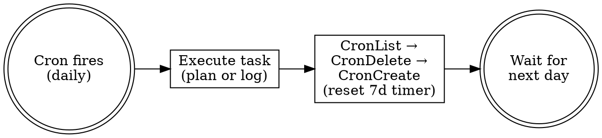

# Persistent Scheduling (CronCreate 自续期)

可选：设置 durable cron，让 Claude Code 自动生成晨间计划和晚间日志。

**原理**：`CronCreate(durable=true)` 持久化到 `.claude/scheduled_tasks.json`，重启存活。recurring 任务 7 天自动过期，所以每次执行时自我续期——删旧建新，重置 7 天倒计时。

**前提**：Claude Code 每天会打开。没开的日子不触发（也不需要——没干活不用写日志）。

## Setup

在任意 Claude Code session 中执行一次：

```
帮我设置 dev-horcrux 持久调度：创建两个 durable cron（晨间计划 09:05 + 晚间日志 19:05），带自续期。
```

或手动创建：

**Morning Plan Cron:**
```
CronCreate:
  cron: "5 9 * * *"
  recurring: true
  durable: true
  prompt: |
    [DEV-HORCRUX MORNING CRON]
    Use the dev-horcrux skill to generate today's morning plan.
    After completing, self-renew: CronList → find cron with schedule "5 9 * * *" →
    CronDelete → CronCreate with same config and this same prompt. This resets the 7-day expiry.
```

**Evening Log Cron:**
```
CronCreate:
  cron: "5 19 * * *"
  recurring: true
  durable: true
  prompt: |
    [DEV-HORCRUX EVENING CRON]
    Use the dev-horcrux skill to check if today's session log exists.
    If not, generate it using collect-metrics.sh and discover-sessions.sh.
    After completing, self-renew: CronList → find cron with schedule "5 19 * * *" →
    CronDelete → CronCreate with same config and this same prompt. This resets the 7-day expiry.
```

## Self-renewal mechanism



- 每个 cron 独立续期，互不依赖
- 第 7 天（最后一次触发）续期后创建新 cron，旧的自动清除
- SessionStart hook 保留作为 fallback 安全网

## Unscheduling

```
CronList → 找到所有 dev-horcrux cron → CronDelete 逐个删除
```
